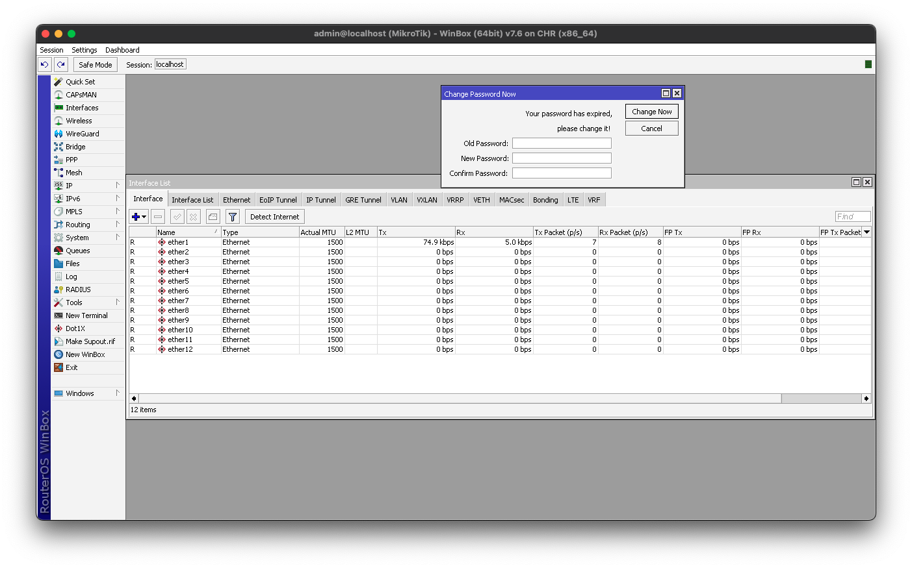
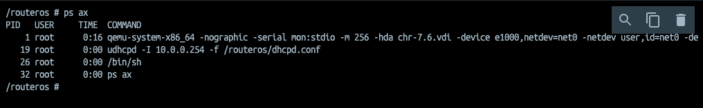
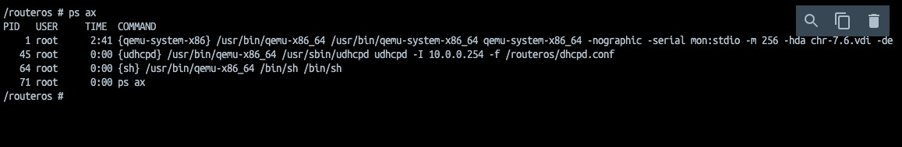

# Mikrotik RouterOS in Docker

Lord BaseX (c) 2014-2023
 Federico Pereira <fpereira@cnsoluciones.com>

This docker image is made for laboratory use and testing only. We are not responsible if you use it for commercial purposes or if you use it in production.

Note: Winbox on MacOS M1 https://github.com/Gcenx/macOS_Wine_builds/releases/download/8.7/wine-devel-8.7-osx86.tar.xz






### Use image from docker hub

```bash
docker pull cnsoluciones/mikrotik
```


### Use in docker-compose.yml

Example is [here](docker-compose.yml).

```yml
services:
    routeros:
        container_name: "mikrotik"
        image: cnsoluciones/mikrotik:7.6
        privileged: true
        ports:
            - "21:21" #ftp
            - "22:22" #ssh
            - "23:23" #telnet
            - "80:80" #www
            - "443:443" #www-ssl
            - "1194:1194" #OVPN
            - "1450:1450" #L2TP
            - "8291:8291" #winbox
            - "8728:8728" #api
            - "8729:8729" #api-ssl
            - "13231:13231" #WireGuard
        cap_add: 
            - NET_ADMIN
        devices: 
            - /dev/net/tun
```
